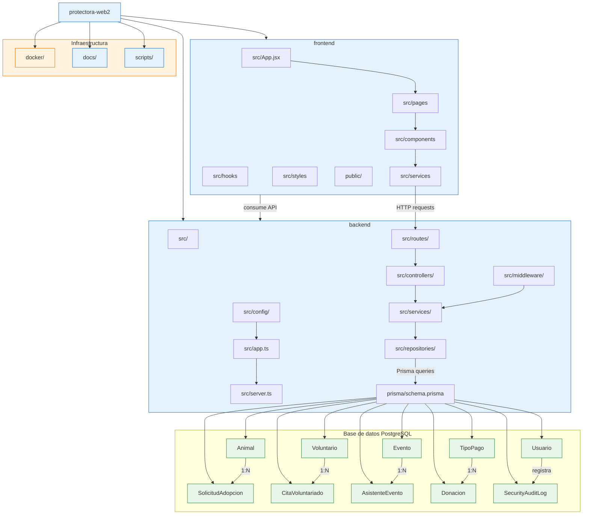

# Estructura del proyecto con base de datos

## Relaciones clave en la BBDD

- Animal 1:N SolicitudAdopcion
- Voluntario 1:N CitaVoluntariado
- Evento 1:N AsistenteEvento
- TipoPago 1:N Donacion
- Usuario guarda auditoría en SecurityAuditLog

## Tecnologías principales

- Frontend: React + Vite + JavaScript/JSX
- Backend: Node.js + Express + Prisma
- Base de datos: PostgreSQL
