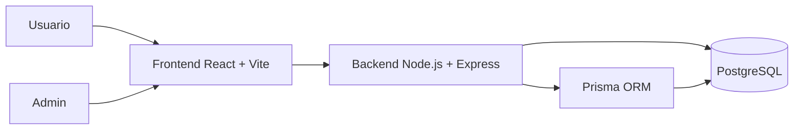
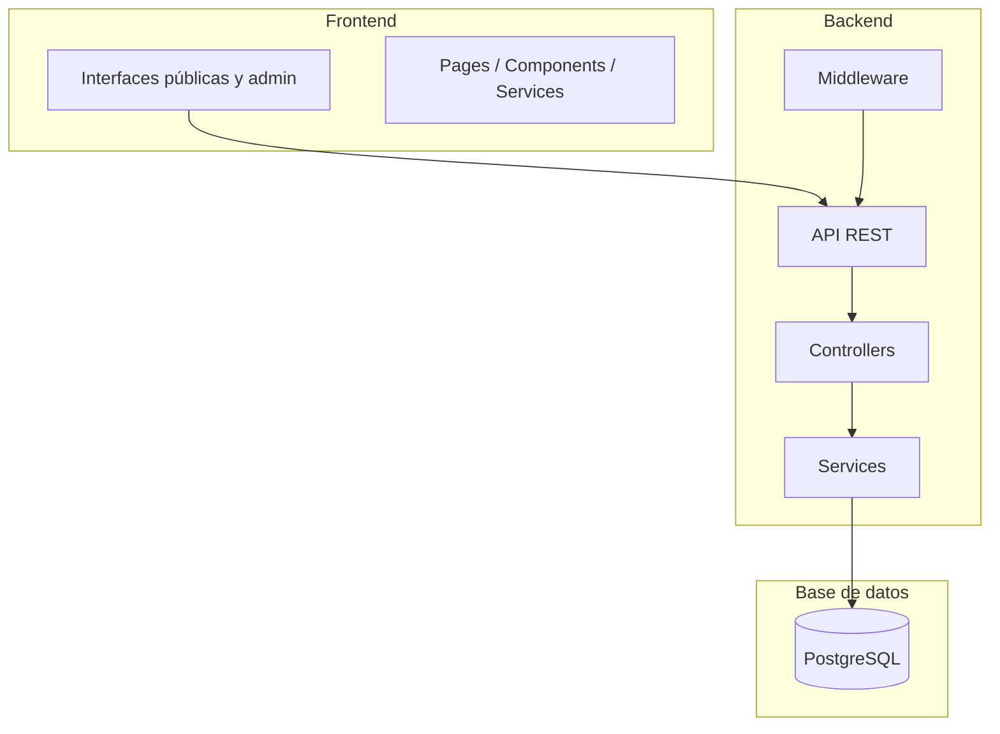

# Protectora Web 2
## Plataforma digital para la gestión integral de una protectora de animales

### Versión final para PowerPoint

---

## Diapositiva 1. Portada

### Protectora Web 2
### Solución digital para gestionar adopciones, voluntariado, eventos y donaciones

- Plataforma moderna y escalable
- Experiencia pública + panel administrativo
- Desarrollo full-stack con arquitectura preparada para crecimiento

**Diseño visual:** fondo claro, colores azul/verde, elementos de iconos de animales, corazón, calendario, donaciones y dashboard.

---

## Diapositiva 2. Resumen ejecutivo

### Una solución que mejora la operación de la protectora

- Centraliza la gestión de animales, personas y eventos
- Reduce la carga administrativa manual
- Mejora la visibilidad y la confianza de usuarios, voluntarios y donantes
- Aumenta la capacidad de captación de adopciones y apoyo económico

### Valor de negocio
- Mejor experiencia del usuario final
- Optimización de procesos internos
- Mayor trazabilidad y control administrativo
- Base tecnológica preparada para ampliación

---

## Diapositiva 3. Problema y oportunidad

### El reto

- Gestión dispersa de adopciones, voluntarios y eventos
- Dificultad para mantener información actualizada
- Procesos manuales y poco automatizados
- Falta de control de seguridad y auditoría

### La oportunidad

- Digitalizar la gestión de la protectora
- Mejorar la participación de la comunidad
- Aumentar la captación de adopciones y donaciones
- Generar una plataforma profesional y sostenible

---

## Diapositiva 4. Objetivos del proyecto

### Objetivos principales

- Simplificar la adopción de animales
- Facilitar el registro de voluntarios y la organización de turnos
- Publicitar eventos y captar asistentes
- Gestionar donaciones de manera clara y segura
- Brindar un panel administrativo con control total

### Objetivos técnicos

- Arquitectura escalable y mantenible
- Seguridad con autenticación y auditoría
- Integración con base de datos robusta
- Implementación con tecnologías modernas

---

## Diapositiva 5. Solución propuesta

### Plataforma integral

- Frontend para usuarios y administración
- Backend con API REST para lógica de negocio
- PostgreSQL como sistema central de almacenamiento
- Prisma como capa de acceso y modelado de datos



### Impacto
- Mejor experiencia para usuarios y administradores
- Información centralizada y consistente
- Mayor rapidez en la gestión diaria

---

## Diapositiva 6. Arquitectura del sistema

### Capas principales

- Frontend: React + Vite
- Backend: Node.js + Express + TypeScript
- Base de datos: PostgreSQL
- Infraestructura: Docker y entorno de despliegue



---

## Diapositiva 7. Modelo de datos clave

### Entidades principales

- Animal
- SolicitudAdopcion
- Voluntario
- CitaVoluntariado
- Evento
- AsistenteEvento
- Donacion
- TipoPago
- Usuario
- SecurityAuditLog

```mermaid
ERDiagram
    ANIMAL ||--o{ SOLICITUD : tiene
    VOLUNTARIO ||--o{ CITA : realiza
    EVENTO ||--o{ ASISTENTE : recibe
    TIPO_PAGO ||--o{ DONACION : acepta
    USUARIO ||--o{ AUDIT : registra
```

### Beneficio
- Estructura clara y escalable
- Relaciones bien definidas
- Trazabilidad de acciones críticas

---

## Diapositiva 8. Funcionalidades principales

### Experiencia pública

- Consulta de animales disponibles
- Envío de solicitudes de adopción
- Registro de voluntariado
- Participación en eventos
- Realización de donaciones

### Panel administrativo

- Gestión de publicaciones y contenido
- Control de adopciones y voluntarios
- Seguimiento de eventos
- Gestión de usuarios y auditoría de seguridad

---

## Diapositiva 9. Seguridad y sostenibilidad

### Seguridad

- Autenticación para administración
- Control de acceso y permisos
- Logs de auditoría de acciones críticas
- Protección de endpoints y validación de peticiones

### Sostenibilidad técnica

- Separación clara de frontend y backend
- Base de datos organizada y normalizada
- Código mantenible y extensible
- Infraestructura preparada para Docker y despliegue

---

## Diapositiva 10. Stack tecnológico

### Tecnologías utilizadas

- Frontend: React + Vite
- Backend: Node.js + Express + TypeScript
- Base de datos: PostgreSQL
- ORM: Prisma
- Contenedores: Docker
- Documentación: Markdown y diagramas Mermaid

### Ventaja competitiva
- Stack moderno y ampliamente adoptado
- Desarrollo rápido y mantenible
- Buen equilibrio entre funcionalidad y escalabilidad

---

## Diapositiva 11. Impacto de negocio

### Resultado esperado

- Mejora en la eficiencia operativa
- Más visibilidad de la protectora en la comunidad
- Aumento de la participación y fidelización
- Mejor gestión financiera y organizativa
- Imagen digital más profesional y confiable

### Mensaje clave
La protectora deja de depender de procesos manuales y pasa a operar con una plataforma digital moderna, útil, segura y preparada para crecer.

---

## Diapositiva 12. Cierre

### Protectora Web 2
### Tecnología que conecta a la protectora con su comunidad

- Más adopciones
- Más voluntariado
- Más eventos
- Más apoyo económico
- Mejor gestión interna

**Frase final:**
Una plataforma digital que transforma la protectora en una organización más eficiente, visible y sostenible.

---

## Sugerencia para diseño visual de PowerPoint

### Estilo recomendado
- Fondo: blanco o gris muy claro
- Colores principales: azul corporativo, verde salud, naranja de acción
- Iconos: animal, corazón, calendar, hand, donation, dashboard
- Tipografías: moderna, limpia, sin demasiados adornos
- Diagrama central: esquema de flujos y modelos de datos con colores diferenciados

### Recomendación de uso
- Mantener 1 idea principal por diapositiva
- Usar pocas palabras y mucha claridad visual
- Dar prioridad a gráficos, diagramas y KPI de impacto
- Finalizar con una frase memorables y un mensaje de valor empresarial
