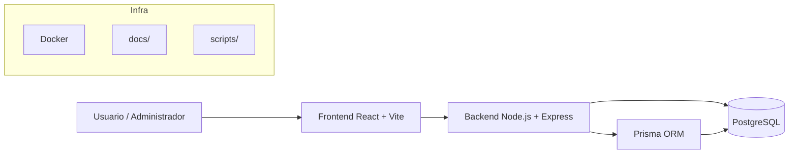

# Presentación del proyecto: Protectora Web 2

## 1. Introducción y objetivos

### Proyecto
Protectora Web 2 es una aplicación full-stack orientada a la gestión de una protectora de animales. La solución combina una experiencia pública para usuarios con un panel administrativo para gestionar contenido y operaciones internas.

### Objetivos principales
- Facilitar la adopción de animales mediante una interfaz pública clara y accesible.
- Permitir la gestión de voluntariado, eventos y donaciones desde un mismo sistema.
- Centralizar la administración del contenido y la seguridad de la plataforma.
- Ofrecer una infraestructura preparada para desarrollo, pruebas y despliegue.

### Funcionalidades clave
- Gestión de animales y solicitudes de adopción.
- Registro de voluntarios y gestión de citas.
- Publicación y gestión de eventos.
- Recepción de donaciones con tipos de pago.
- Panel administrativo con autenticación y auditoría.

---

## 2. Arquitectura del sistema

### Visión general
El proyecto está dividido en tres capas principales:
- Frontend: experiencia de usuario y panel administrativo.
- Backend: API REST con lógica de negocio y autenticación.
- Base de datos: PostgreSQL gestionada con Prisma.



### Frontend
- Tecnología: React + Vite
- Funcionalidades públicas: adopciones, voluntariado, eventos y donaciones.
- Funcionalidades administrativas: autenticación, gestión y control de contenido.

### Backend
- Tecnología: Node.js + Express + TypeScript
- API REST con prefijo /api
- Seguridad: headers, rate limiting, autenticación, auditoría.
- Integración con Prisma para acceder a la base de datos.

### Base de datos
- Motor: PostgreSQL
- ORM: Prisma
- Esquema central con entidades de negocio y logs de seguridad.

### Flujo de ejecución
1. El usuario accede a la aplicación desde el frontend.
2. La interfaz realiza llamadas al backend.
3. El backend valida permisos y procesos.
4. Prisma ejecuta consultas sobre PostgreSQL.
5. El frontend renderiza la información obtenida.

---

## 3. Modelo de datos y relación entre entidades

### Entidades principales
- Animal
- SolicitudAdopcion
- Voluntario
- CitaVoluntariado
- Evento
- AsistenteEvento
- Donacion
- TipoPago
- Usuario
- SecurityAuditLog

```mermaid
ERDiagram
    ANIMAL ||--o{ SOLICITUD_ADOPCION : tiene
    VOLUNTARIO ||--o{ CITA_VOLUNTARIADO : realiza
    EVENTO ||--o{ ASISTENTE_EVENTO : recibe
    TIPO_PAGO ||--o{ DONACION : acepta
    USUARIO ||--o{ AUDIT_LOG : registra

    ANIMAL {
        int id PK
        string name
        string species
        int age
        string description
        string[] images
    }

    SOLICITUD_ADOPCION {
        int id PK
        int animalId FK
        string nombre
        string email
        string telefono
        string mensaje
        string estado
    }

    VOLUNTARIO {
        int id PK
        string nombre
        string email
        string telefono
        string disponibilidad
        string mensaje
    }

    CITA_VOLUNTARIADO {
        int id PK
        int voluntarioId FK
        datetime inicio
        datetime fin
        string estado
        string notas
    }

    EVENTO {
        int id PK
        string titulo
        string descripcion
        datetime fecha
        string lugar
        string[] images
    }

    ASISTENTE_EVENTO {
        int id PK
        int eventoId FK
        string nombre
        string email
        string telefono
        string mensaje
    }

    DONACION {
        int id PK
        float cantidad
        string nombre
        string email
        int metodoId FK
        string tipoDonacion
    }

    TIPO_PAGO {
        int id PK
        string tipo
        string label
        string account
    }

    USUARIO {
        int id PK
        string nombre
        string email
        string role
        bool mfaEnabled
        string mfaSecret
    }

    AUDIT_LOG {
        int id PK
        datetime createdAt
        int userId FK
        string email
        string action
        bool success
        string ip
        string userAgent
        string path
        string method
        string reason
        json metadata
    }
```

### Relaciones clave
- Un animal puede tener muchas solicitudes de adopción.
- Un voluntario puede tener muchas citas de voluntariado.
- Un evento puede tener muchos asistentes.
- Un tipo de pago puede estar asociado a varias donaciones.
- Los usuarios generan registros de auditoría para acciones críticas.

### Relevancia del modelo
El esquema permite gestionar todos los procesos de la protectora dentro de una única base de datos relacional, manteniendo consistencia y trazabilidad de las operaciones.

---

## 4. Estructura del repositorio

```text
protectora-web2/
├── backend/
│   ├── prisma/
│   ├── src/
│   ├── controllers/
│   ├── routes/
│   ├── services/
│   ├── repositories/
│   └── middleware/
├── frontend/
│   ├── src/
│   ├── public/
│   └── package.json
├── docker/
├── docs/
├── scripts/
├── README.md
├── package.json
└── prisma/
```

### Importancia de la organización
- Backend y frontend están separados para mantener una arquitectura limpia.
- Prisma centraliza la definición del esquema de datos.
- La carpeta docs permite documentar arquitectura y modelos.
- Docker facilita la ejecución en entornos de desarrollo y producción.

---

## 5. Conclusión

Protectora Web 2 combina una solución moderna de frontend, backend y base de datos para cubrir todas las necesidades de una protectora de animales. La arquitectura es escalable, modular y preparada para crecimiento futuro, con una base de datos bien estructurada y mecanismos de auditoría y seguridad.

### Resultado esperado
Una plataforma útil para:
- público general,
- administradores,
- voluntarios,
- y donantes,
con una experiencia coherente y una gestión centralizada.
